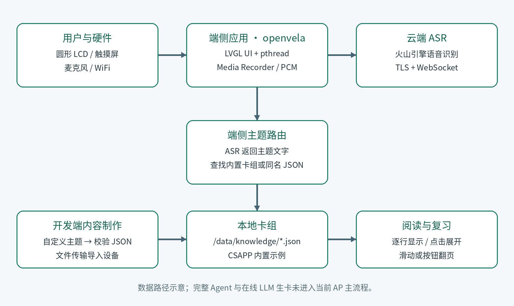
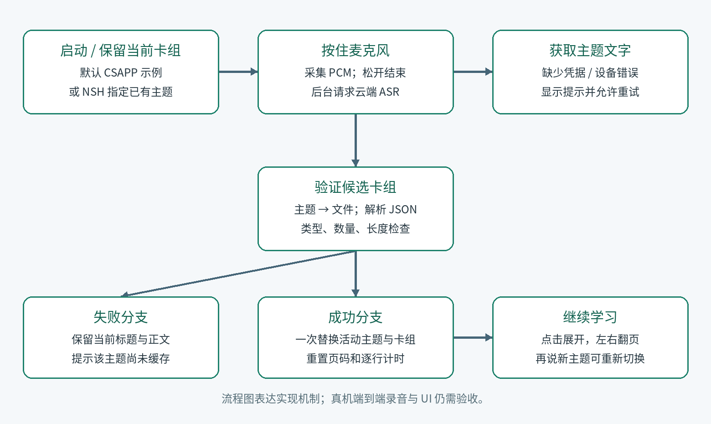

# 知镜 KnowLens——知识闪卡 UI 原型

2026 首届 openvela AI 硬件开发者大赛 · 技术报告

提交日期：2026 年 9 月 20 日　|　队伍编号：302　|　版本：初步 UI 展示版

## 1、信息表

| 项目 | 内容 |
| --- | --- |
| 作品名称 | 知镜 KnowLens——知识闪卡 |
| 队伍名称 | 欣欣向荣（xinxinxiangrong） |
| 团队分工 | 吴荣飞（GitHub：lknt）：负责全部工作，包括产品构思、UI 设计、应用开发、板级构建、调试、文档和提交材料整理。 |
| 选题方向 | AI 硬件产品创新；本阶段完成知识闪卡 UI 原型。AI 内容生成、语音输入和完整端云链路列为后续开发方向。 |
| 目标开发板 | 恒玄 BES2800BP，openvela 工程配置：`best1700_ep/aos_evb` |
| 赛事专属仓 | https://github.com/open-vela/contest2026_302_xinxinxiangrong |
| 开发仓与分支 | https://github.com/lknt/contest2026_302_xinxinxiangrong · `dev-ai-contest-2026` |

## 2、摘要

知镜 KnowLens 是面向学生、程序员和碎片化学习者的知识闪卡 UI 原型，目标是在可穿戴设备的小尺寸显示屏上把知识内容拆成易阅读、易翻页的短卡片。本阶段基于 BES2800BP 和 openvela/LVGL 完成了显示屏布局、卡片容器、标题与正文排版、逐行显示、点击展开和左右翻页等初步 UI 展示。当前内容为固件内置的演示文本，未接入 AI 生成、云端大模型或动态内容服务；开发板也未完成麦克风接入和真实语音链路验证。因此，本提交聚焦于可编译、可烧录的 UI 原型，语音输入、AI 生成卡片、主题管理、学习记录和端云协同均作为后续实现方向。

## 3、正文

### 3.1 绪论

**项目背景与问题定义。** 手机适合阅读长文本，但不适合在通勤、课间等碎片时间快速完成一次知识复习；手表类小屏设备又受到显示面积和输入方式限制。知镜希望把一个知识主题拆成短内容卡，在显示屏上以清晰的层级呈现，让用户可以快速阅读一条知识点，再通过翻页继续学习。

当前阶段只验证“显示屏上的知识卡片如何呈现”。固件中的文字是用于 UI 演示的预置示例内容，并非由 AI 在设备上生成。用户可以在未来版本中选择学科、导入内容或使用云端 AI 生成卡片；这些能力尚未作为本次完成成果提交。

**技术难点。** 本阶段的主要难点是：在 454×454 的显示区域中建立适合屏幕边缘的安全布局；让标题、正文、分页和操作按钮在有限空间内保持清晰；使用中文字体在固件中稳定显示；控制逐行展示和翻页的状态，避免长文本一次性挤在小卡片内。

**阶段性创新点。** 作品尝试把“短知识内容 + 逐行阅读 + 显示屏触控翻页”组合成可穿戴设备上的学习界面。当前创新主要体现在交互形态和小屏排版探索，尚不宣称已完成 AI 算法创新或完整的智能学习闭环。

### 3.2 系统方案设计

**当前版本总体架构。** 本阶段的已交付链路是：BES2800BP 启动 openvela → LVGL 创建显示屏安全区 → 应用加载固件内置示例文本 → 以卡片形式显示 → 用户点击或翻页查看内容。麦克风、WiFi、云端 ASR 和 LLM 生卡位于规划架构中，代码仓内保留了部分实验性接口，但未作为当前 UI 原型的已完成能力。

| 功能模块 | 当前状态 | 所需硬件或系统能力 | 后续计划 |
| --- | --- | --- | --- |
| 显示区域知识卡 UI | 已完成初步展示 | 454×454 LCD、CPU、RAM、LVGL | 继续优化屏幕边缘适配、动效和可读性 |
| 逐行显示与点击展开 | 已完成代码实现 | LCD、系统定时器、触控事件 | 根据实机体验调整节奏和字号 |
| 左右翻页 | 已完成代码实现 | 触控输入、LCD | 增加更稳定的手势识别和边界反馈 |
| 演示文本 | 已完成静态内置示例 | Flash/代码存储、RAM | 改为可导入的课程内容和主题卡组 |
| 麦克风语音输入 | 未接入、未验收 | 麦克风、音频采集链路、Media 服务 | 完成硬件接线、录音和异常提示 |
| WiFi/云端 ASR | 未接入、未验收 | WiFi、DNS、TLS、麦克风 | 接入语音识别并做真实网络测试 |
| AI 自动生成知识卡 | 未接入 | 云端模型、网络、JSON 解析和存储 | 接入大模型，增加结构化输出和内容审核 |

本阶段不依赖摄像头、麦克风、WiFi 或 PWM 才能展示 UI；UI 演示只需要开发板显示链路和触控输入。麦克风、WiFi 等能力仅属于后续方案，不能写成当前已经具备的产品功能。

**开发板选型理由。** BES2800BP 具有适合本项目的显示屏和触控开发条件，能够直接验证可穿戴显示屏上的信息层级与交互距离。选择它的理由是便于完成 openvela/LVGL UI 原型，且后续可以继续探索音频和网络扩展；本阶段没有声称完成新硬件平台适配，也没有声称麦克风已接通。

| 备选方案 | 适合点 | 本阶段取舍 |
| --- | --- | --- |
| BES2800BP + openvela + LVGL | 可直接验证可穿戴显示屏 UI | 采用，先完成显示原型 |
| 手机网页 | 内容编辑方便、屏幕较大 | 不能体现显示区域穿戴设备的交互约束 |
| 其他开发板 | 可能提供更完整的音频或 AI 例程 | 会引入新的 BSP 和显示适配工作，不利于本阶段聚焦 UI |

**断网策略。** 当前 UI 使用固件内置文本，不依赖网络，因此在没有 WiFi 的情况下仍可展示和翻页。未来接入 AI 后，将设计“已有本地卡片可继续阅读、云端生成失败时提示重试”的降级策略；目前没有真实云端链路，不能报告弱网时延或云端失败率。

### 3.3 核心算法与技术原理

**当前阶段。** 当前没有端侧 AI 模型、云端 LLM 或 AI 自动生成卡片。应用主要由静态数据、UI 状态机和 LVGL 定时器组成：启动时选择当前卡片；定时器逐步增加可见文本行数；点击卡片时显示完整正文；左右按钮或手势改变卡片索引。该逻辑是 UI 演示机制，不应被描述为 AI 算法。

**内容方案。** 演示文本直接编译进固件，用于展示标题、分隔线、正文和分页效果。内容没有经过云端生成，也没有实现自动摘要、知识图谱、个性化推荐或学习效果评估。未来会设计统一的结构化卡片格式，再接入云端模型生成和人工/规则审核。

**openvela 能力运用。** 已实际使用的重点是图形能力：openvela/NuttX 应用入口、LVGL 对象树、显示驱动和触控输入。Media、WiFi、TLS、ASR 和 LLM 目前只属于后续技术储备或实验性代码，未纳入本阶段功能验收。对 openvela 的改进建议是提供显示屏安全区布局示例、中文字体资源说明和更简洁的 LVGL 手势模板。

### 3.4 系统实现

**软件/固件架构。** `knowledge_cards_main.c` 负责当前 UI 原型的屏幕、卡片、分页、逐行展示和触控事件；字体以 C 数组编译进固件；Kconfig、CMake 和 Make 文件负责将应用加入 openvela 构建。仓内的录音、ASR、JSON 卡组和 LLM 原型文件是为后续迭代保留的实验性代码，当前报告不把它们计入已完成产品能力。

**应用/交互端设计。** 屏幕为 454×454，UI 在中心建立约 424×424 的显示安全面板，四周保留边缘空间；中央为知识卡，顶部显示应用标题，底部放置分页和导航控件。正文按行逐步出现，点击卡片可展开全文。显示区域面板是布局背景，中央文字卡仍为卡片边缘矩形，这是当前 UI 的设计选择。

**硬件设计与适配。** 本阶段没有设计新 PCB，没有开发新的显示、触控或音频驱动，也没有完成全新硬件平台移植。工作内容是使用 BES2800BP 现有 BSP 编译和运行 UI 应用。麦克风没有接入，不能在 BOM 或演示中声称已完成录音硬件功能。

**当前操作方式。** 烧录 AP 固件并重启后，应用进入知识闪卡 UI；用户通过触控点击卡片、左右按钮或左右滑动查看预置演示内容。当前没有可用的语音主题选择流程，也没有 AI 生成卡片流程。

**自定义 Skill。** 仓内保留了 `skills/knowledge-cards-author/SKILL.md`，用于未来制作主题卡片时约束 JSON 格式和小屏排版；`knowledge-cards-topic.md` 是未来运行时 Skill 的设计草案。当前固件没有启用完整 Agent 运行时，Skill 尚未在设备上触发验收，因此只作为后续开发文档提交。

### 3.5 系统测试与结果分析

**测试环境。** 使用 Linux 主机和 BES best1700_ep/aos_evb 配置进行编译检查。主机上的语音和卡组脚本属于实验性模块的 Mock/单元测试，不能代表麦克风、WiFi、云端 AI 或真实开发板已经通过验收。

| 测试项 | 本次结果 | 说明 |
| --- | --- | --- |
| AP 固件编译 | 构建成功 | 证明当前源码可完成配置、编译和链接 |
| UI 源码集成 | 已纳入 openvela 应用构建 | 证明应用入口、LVGL 依赖和字体资源可参与构建 |
| 静态示例文本 | 已用于 UI 展示 | 内容为固件内置示例，不是 AI 生成内容 |
| 触控与显示屏视觉效果 | 初步 UI 展示 | 尚未形成正式的视频、照片和多轮交互测试记录 |
| 麦克风录音 | 未测试 | 未接入麦克风 |
| WiFi/ASR | 未测试 | 未配置真实云端服务 |
| AI 生成知识卡 | 未实现 | 后续开发内容 |
| 功耗、帧率、端到端时延 | 未测量 | 当前阶段没有可靠实测数据 |

链接器报告可以作为构建规模参考，但不能替代产品性能测试。当前不提交识别准确率、网络响应时间、录音成功率、功耗或连续运行时长等数据，因为这些功能尚未接入和测量。

**当前阶段结论。** 已完成的是“能够编译并展示知识闪卡 UI 的软件原型”。尚未完成的是“可以通过麦克风输入主题并由 AI 自动生成卡片的完整产品”。两者在报告中明确区分，避免将规划能力写成当前成果。

### 3.6 AI-Native 开发说明

| 指标 | 数据与口径 |
| --- | --- |
| AI Coding 代码占比 | 未做逐行归因，不填写未经核实的百分比。字体生成数组、厂商 SDK 和上游代码不计入业务代码。 |
| 使用的 AI 工具 | Claude Code、Codex；主要用于需求拆解、LVGL UI 编写、构建排障、文档整理和提交材料检查。 |
| MCP 工具使用情况 | 本次没有可核实的 VelaJS MCP 或 Figma MCP 使用记录，不作申报。 |
| Skills 使用与新增 | 使用 skill-creator 整理了知识卡片制作 Skill；新增开发 Skill 和未来运行时 Skill 草案，均未作为设备端已验收功能。 |
| Token 使用总量 | 未取得跨工具可去重账单，不虚报总量；日志中保留可审计的对话和工具事件。 |
| AI 对开发的帮助 | 主要帮助完成显示屏布局、LVGL 事件组织、构建问题定位和报告整理；AI 没有替代人工硬件验证，麦克风和 AI 生卡仍未完成。 |

AI Coding 日志位于参赛仓 `logs/`，其中包含用户 prompt、助手回复和工具事件。报告只把已完成的 UI 与构建工作作为成果，未把对话中讨论过的语音和 AI 方案当作交付能力。

### 3.7 总结与展望

**成果总结。** 本阶段完成了基于 BES2800BP/openvela 的知识闪卡 UI 原型：建立显示区域安全布局，完成卡片、标题、正文、分页和触控交互，并将示例文本编译进固件用于初步展示。项目验证了在可穿戴显示屏上承载知识卡片的界面方案。

**未来工作。** 下一阶段按以下顺序推进：

1. 接入并确认开发板实际麦克风、音频采集链路和 Media 服务，完成录音状态与异常处理。
2. 接入 WiFi 和云端语音识别，让用户可以说出学习主题；在无网络时保留本地演示内容。
3. 接入大模型（优先评估大赛推荐模型或兼容接口），将主题生成结构化知识卡，并增加长度约束、来源提示和内容审核。
4. 实现主题导入、持久化存储、学习记录和间隔重复；再进行真实设备的时延、功耗、连续运行和交互测试。
5. 完成运行时 Skill 的 Agent 触发验收，并录制真实功能演示视频和拍摄开发板实物照片。

**应用前景。** 目标用户是需要短时复习的学生、程序员和职业学习者。未来可围绕课程卡组、职业技能卡组和个人知识库提供内容服务。当前仍处于 UI 原型阶段，没有用户规模、商业收入或量产成本数据，不作商业化承诺。

## 附录 A：提交材料与复现索引

| 材料/审核项 | 本次提供 | 说明 |
| --- | --- | --- |
| 技术报告 | DOCX、PDF、Markdown、架构图与流程图 | 已按吴荣飞一人负责全部工作填写 |
| 源码与 AI Coding 日志 | 位于赛事参赛仓 | 日志保留 prompt 与工具事件 |
| 演示视频 | 录制脚本 | 当前尚需录制真实 UI 展示视频 |
| 硬件实物照片 | 未提供 | 需补充 BES2800BP 前/后/侧/俯视照片 |
| 自定义 Skill | 开发草案和运行时草案 | 当前未在设备上完成 Agent 触发验收 |

源码与 AI Coding 日志按模板放在专属 GitHub 仓库，技术报告材料单独打包提交。当前材料包尚缺真实演示视频和硬件实物照片，提交官网前应补齐。

## 附录 B：评审维度对照

| 评审维度 | 报告对应章节 |
| --- | --- |
| 技术难度（30） | 3.2 系统方案、3.3 技术原理、3.4 系统实现、3.5 测试 |
| 产品创新性（20） | 摘要、3.1 显示屏知识卡交互 |
| 项目完整度（20） | 3.4 实现状态、3.5 测试结果、源码与演示材料 |
| AI 开发（10） | 3.6 AI-Native 开发说明；AI 生卡列为未来工作 |
| 商业潜力（10） | 3.7 应用前景与后续规划 |
| 展示效果（10） | UI 演示视频、实物照片和报告图示 |
